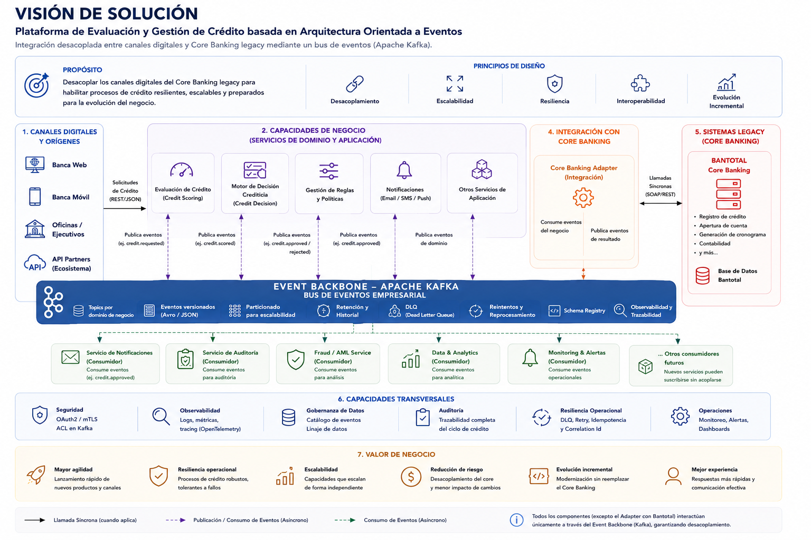
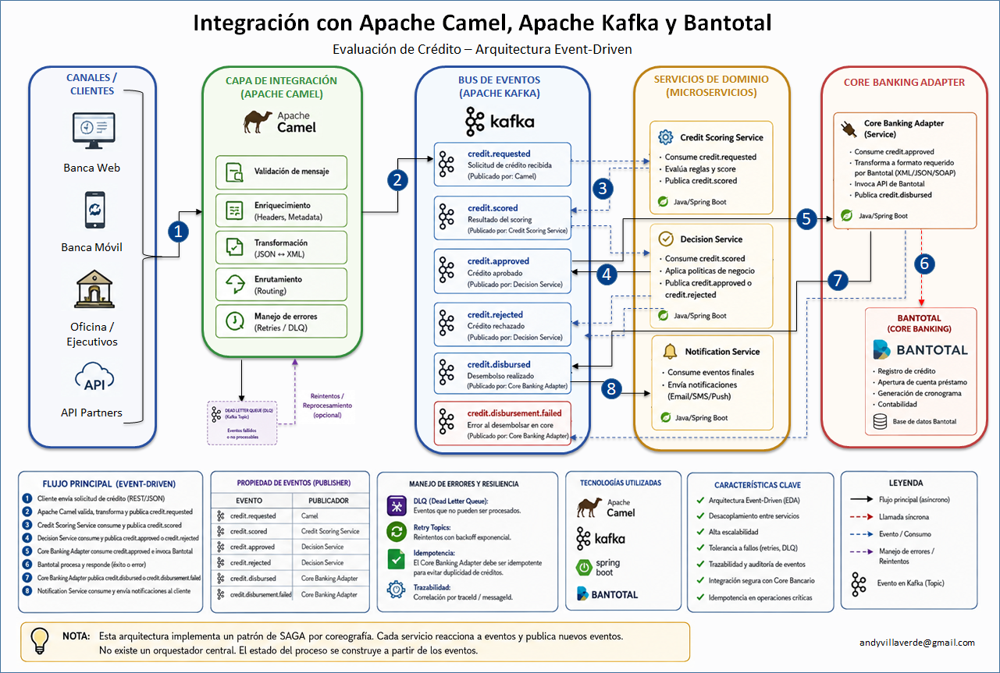

## Arquitectura de modernización para procesamiento crediticio desacoplado orientada a eventos, diseñada para integrar plataformas digitales con Core Banking legacy minimizando acoplamiento, mejorando resiliencia operacional y habilitando escalabilidad horizontal

## Apache Kafka + Apache Camel + Spring Boot + Bantotal Integration ##

## 1. Problema del negocio: ##

### 1.1 Situación actual: ###
Los sistemas core bancarios legacy presentan:
- alto acoplamiento
- integraciones síncronas frágiles
- baja escalabilidad
- dificultad para incorporar nuevos canales digitales

### 1.2. Propuesta
Implementar una arquitectura event-driven desacoplada basada en Apache Kafka y Apache Camel para separar decisiones de negocio, integración y procesamiento operacional.

### 1.3. Beneficios
- Resiliencia ante fallas del Core Banking
- Integración desacoplada
- Escalabilidad independiente
- Reprocesamiento seguro
- Mayor observabilidad
- Evolución incremental
- Menor impacto en sistemas legacy

### 1.4. Capacidad futura
La arquitectura permite incorporar nuevos consumidores de eventos sin afectar servicios existentes:
- fraude
- analytics
- auditoría
- machine learning
- omnicanalidad

## 2. Vision de Solución ##

## 3. Arquitectura de solución / Arquitectura Lógica ##

## 4. Implementación Incremental ##
### 4.1. Fase 1 backbone mínimo funcional ###
Demostrar el flujo EDA básico.

**Componentes:**

**4.1.1. Apache kafka:**
Archivo docker-compose.yml

kafka-bank:
image: confluentinc/cp-kafka:7.5.0
Imagen oficial de Docker proporcionada por Confluent que contiene una distribución empaquetada y lista para desplegar de Apache Kafka 

kafdrop-bank:
Una interfaz web para monitorizar clústeres de Apache Kafka. La herramienta muestra información como brokers, temas, particiones, consumidores (incluido el retardo) y permite ver los mensajes.

**4.1.2. Apache Camel:**
Archivo docker-compose.yml

camel-credit-demo: Proyecto camel-credit-demo

**4.1.3. Credit Scoring Service**

**4.1.4. Decision Service**

**3 camel-credit-demo:**

### 4.2. Fase 2 Integración bancaria ###
Agrega Core Banking Adapter 
- consume credit.approved
- simule llamada Bantotal
- publique credit.disbursed

### Fase 3 — Notification Service
Consume eventos finales.

### Fase 4 — Resiliencia
Agrega:
- retries
- DLQ
- idempotencia

### Fase 5 — Observabilidad
- correlation-id
- tracing
- logs estructurados